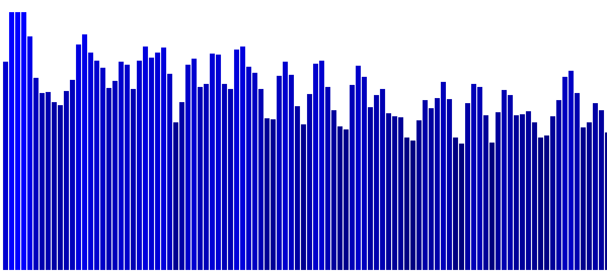
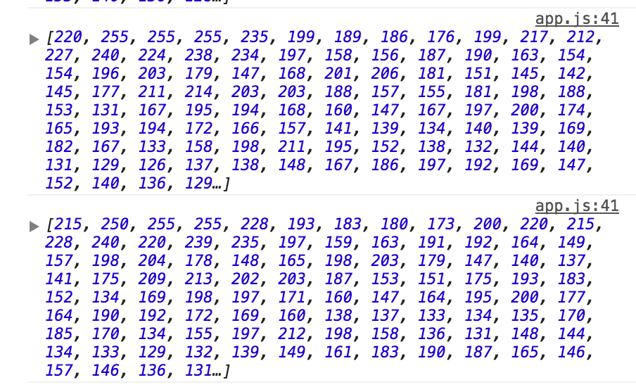

In my previous post we created a [bar chart using D3.js.](https://www.bignerdranch.com/blog/create-data-driven-documents-with-d3js/)
While brainstorming ideas on how to elaborate on my first post, I had a flashback to music visualizers in WinAmp where shapes would beautifully expand and contract with the frequency of the music. I thought this would be a great opportunity for me to learn the Web Audio API as well as display what D3 can do. You can view the [finished visualizer here](http://bignerdranch.github.io/music-frequency-d3/).



First, lets add our HTML <audio> source and controls.
```html
<audio id="audioElement" src="./audio/Odesza - Above The Middle.mp3"></audio>
<div>
  <button onclick="document.getElementById('audioElement').play()">Play the Audio</button>
  <button onclick="document.getElementById('audioElement').pause()">Pause the Audio</button>
  <button onclick="document.getElementById('audioElement').volume+=0.1">Increase Volume</button>
  <button onclick="document.getElementById('audioElement').volume-=0.1">Decrease Volume</button>
</div>
```

Point the source of the <audio> element to your audio file. In this case I created an audio folder and added an mp3 of Odesza's song "Above The Middle", available for [free download from their website](http://odesza.com/music/category/releases/). But, if you think my taste in music is horrendous feel free to use your own!

If you were to open up your index.html now you should be able to play, pause and increase/decrease the volume of your audio file. All you have to do now is slap a 500 page Terms of Service agreement on it and you got yourself an app! Eh, not quite.

To be able to make a visualization we need to grab the _data_ from the song and then interpret it. Introducing the...

## Web Audio API

The Web Audio API gives you access to control, modify and interpret audio within the browser. I was surprised by how much data you can retrieve about an audio file and there are endless possibilities for modification. You can grab the frequency data, time info, create an oscilloscope or a voice modulator and much more. Once you have the streaming frequency data, you could make whatever visualization you can imagine! It's pretty exciting for me and hopefully it is for you too. For a full explanation on the Web Audio API, MDN has some pretty great [documentation](https://developer.mozilla.org/en-US/docs/Web/API/Web_Audio_API). But think of it as the middle-man between an audio input and output, effectivaly hijacking your audio through a context and network of nodes before it reaches its output (speakers).

```javascript
var audioCtx = new (window.AudioContext || window.webkitAudioContext)();
var audioElement = document.getElementById('audioElement');
var audioSrc = audioCtx.createMediaElementSource(audioElement);
var analyser = audioCtx.createAnalyser();

// Bind our analyser to the media element source.
audioSrc.connect(analyser);
audioSrc.connect(audioCtx.destination);
```
Here we are creating our [AudioContext](https://developer.mozilla.org/en-US/docs/Web/API/AudioContext), getting our <audio> element, turning it into a [MediaElementAudioSourceNode](https://developer.mozilla.org/en-US/docs/Web/API/MediaElementAudioSourceNode) so that we can manipulate the audio from its source, creating our [AnalyserNode](https://developer.mozilla.org/en-US/docs/Web/API/AnalyserNode) so that we can retrieve frequency data. Finally, we use the audioSrc.connect() method to connect the _output_ of our <audio> element to the _input_ of our analyser, and then connect to the audioCtx.destination (our speakers).

## Updating The Chart

We need to make a few changes to the D3 code from my first [blog post](https://www.bignerdranch.com/blog/create-data-driven-documents-with-d3js/).

```javascript
var frequencyData = new Uint8Array(200);

var svgHeight = '300';
var svgWidth = '1200';
var barPadding = '1';

function createSvg(parent, height, width) {
  return d3.select(parent).append('svg').attr('height', height).attr('width', width);
}

var svg = createSvg('body', svgHeight, svgWidth);

// Create our initial D3 chart.
svg.selectAll('rect')
   .data(frequencyData)
   .enter()
   .append('rect')
   .attr('x', function (d, i) {
      return i * (svgWidth / frequencyData.length);
   })
   .attr('width', svgWidth / frequencyData.length - barPadding);
```
The `frequencyData` array will be where we will copy our audio frequency data to. I also increased the size of the svg to accomodate the larger amount of data points. Lastly I removed the rectangle's height and Y attributes because they will be blank until the song is played, we are only concerned with adding 200 rectangles and setting their x and width values at initial screen load.

## Streaming Frequency Data
Now comes the fun part, constantly streaming audio data to the browser and dynamically updating the D3 bar chart.

```javascript
// Continuously loop and update chart with frequency data.
function renderChart() {
   requestAnimationFrame(renderChart);

   // Copy frequency data to frequencyData array.
   analyser.getByteFrequencyData(frequencyData);

   // Update d3 chart with new data.
   svg.selectAll('rect')
      .data(frequencyData)
      .attr('y', function(d) {
         return svgHeight - d;
      })
      .attr('height', function(d) {
         return d;
      })
      .attr('fill', function(d) {
         return 'rgb(0, 0, ' + d + ')';
      });
}

// Run the loop
renderChart();
```
Lets break it down, `renderChart()` will loop continuously and update our frequencyData and chart. It will loop because `window.requestAnimationFrame(renderChart)` tells the browser to run `renderChart()` again before repainting the screen.

Most importantly we need to get the audio data. `analyser.getByteFrequencyData(frequencyData);` will use our attached AnalyserNode to grab the frequency data of the audio and copy it to our Uint8Array frequencyData that we created earlier. If you were to set the length of the frequencyData array to `analyser.frequencyBinCount` it would default to 1024. I opted to limit the length to 200 to make the chart a little easier to see. If you want data on the entire audio spectrum feel free to use the total length, but 200 gives us a pretty good sample to work with.

If you were to put a `console.log(frequencyData)` inside the `renderChart()` function and looked at the output, you'll see a Matrix-like stream of numbers.



With that data you can make any visualization you want! For now, lets bind the streaming data to the D3 chart. Since we just need to update the data on our chart, there's no need to .append() anything, just need to update the data, _y_, _height_ and _fill_ values. Since the range of frequency data is 0-255, it's perfect for using as the rgb value. This will make the color a brighter blue for frequencies that are higher.

That's it! You can view the [source code here](https://github.com/bignerdranch/music-frequency-d3), and the [finished demo here](http://bignerdranch.github.io/music-frequency-d3/).
